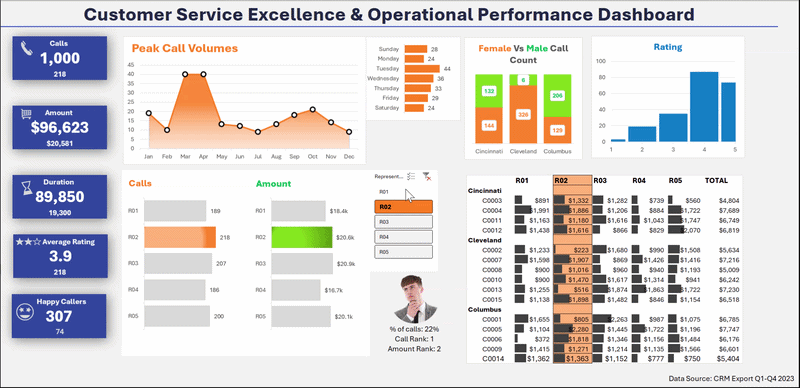
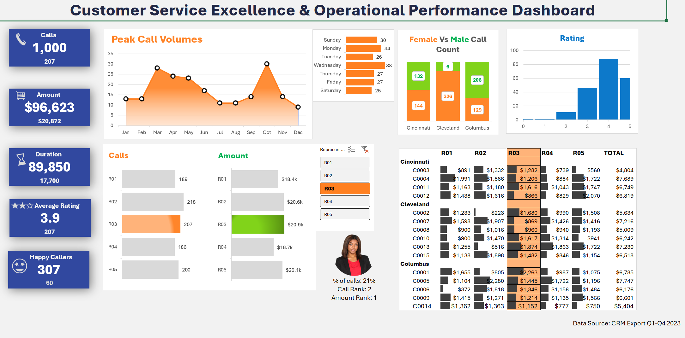
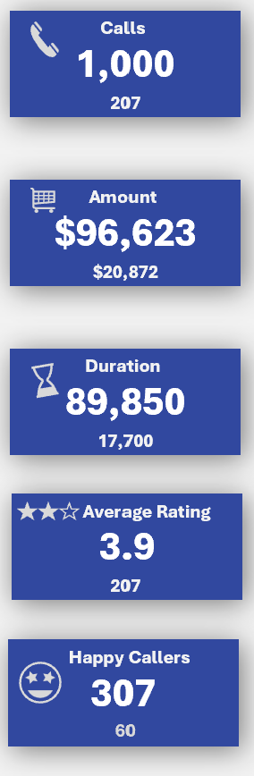
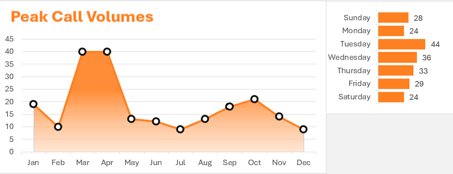
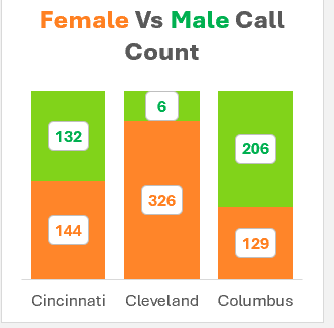
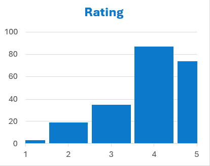
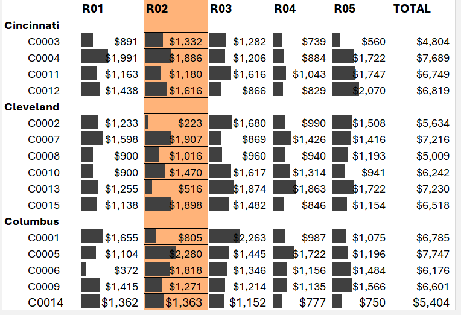
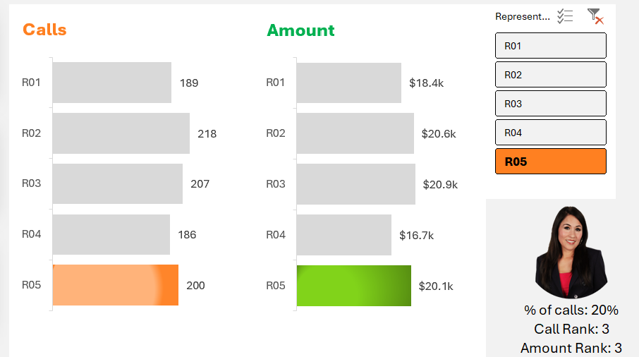

# 📊 Customer Service Excellence & Operational Performance Dashboard

> **Excel · Pivot Tables · Dynamic Slicers · KPI Cards · Omni-Channel Operations Analytics · 2023**

---

## 🎬 Live Demo



> *Watch the interactive slicer in action — click any representative and watch all KPIs, charts, and the regional revenue table update instantly in real time.*

---

## 📸 Full Dashboard



---

## 🔍 Project Overview

This project delivers a fully interactive **Excel-based operational performance dashboard** built on a 2023 omni-channel customer service dataset of **1,000 call records** across three regional service centers — Cincinnati, Cleveland, and Columbus.

The dashboard tracks agent productivity, customer satisfaction, revenue contribution, call volume trends, and demographic service patterns — translating raw operational data into executive-ready insights through dynamic pivot charts and an interactive representative slicer.

Designed to mirror the analytical workflows found in **clinical operations, healthcare contact centers, and supply chain service environments**, this dashboard enables decision-makers to monitor performance, identify service bottlenecks, and optimize resource allocation at both the macro and individual rep level.

---

## 🎯 Business Problem

Customer-facing operations generate high volumes of interaction data that go underutilized without a structured reporting layer. This dashboard answers critical operational questions:

- Which representatives drive the highest revenue and call volume?
- Which months and days of the week create peak service demand?
- How do satisfaction ratings distribute across the 0–5 scale?
- How are calls split by gender across regional service centers?
- Which customer segments generate the highest purchase value per rep?
- Where are the service efficiency gaps that need intervention?

---

## 📁 Repository Structure

```
📦 customer-service-performance-dashboard/
│
├── 📊 Customer_Service_Excellence___Operational_Performance_Dashboard.xlsx
├── 📄 README.md
├── 📄 DATA_DICTIONARY.md
│
└── 📁 assets/
    ├── dashboard_preview.png
    ├── kpi_cards.png
    ├── peak_call_volumes_trend_monhtly_and_Toatal_number_of_call_in_a_day.png
    ├── Female_Vs_male_Call_count.png
    ├── Ratings.png
    ├── regional_breakdown.png
    └── rep_performance.png
```

---

## 📐 Dataset at a Glance

| Attribute | Details |
|---|---|
| **Dataset** | 2023 Omni-Channel Customer Service & Sales Performance |
| **Total Records** | 1,000 call interactions |
| **Time Period** | Full Year 2023 (Jan – Dec) |
| **Service Centers** | Cincinnati · Cleveland · Columbus |
| **Representatives** | R01, R02, R03, R04, R05 |
| **Unique Customers** | 15 (C0001 – C0015) |
| **Total Revenue** | $96,623 |
| **Total Call Duration** | 89,850 minutes |
| **Avg Satisfaction Rating** | 3.9 / 5.0 |
| **Happy Callers (5★)** | 307 |

---

## 📊 Dashboard Sections

### 🏷️ KPI Summary Cards



Five executive-level metric cards that update dynamically based on the representative slicer. The large number shows the company-wide total; the smaller number beneath shows the selected rep's individual figure.

| KPI | Company-Wide | Per Rep (R03 example) |
|---|---|---|
| Total Calls | 1,000 | 207 |
| Total Revenue | $96,623 | $20,872 |
| Total Duration | 89,850 min | 17,700 min |
| Avg Rating | 3.9 | 3.9 |
| Happy Callers (5★) | 307 | 60 |

---

### 📈 Peak Call Volumes — Monthly Trend & Day-of-Week



**Monthly Trend (Area Chart):** March and April peak at **40 calls each** — the highest volume months of the year. Volume drops sharply in July–August, signaling a seasonal demand pattern critical for workforce capacity planning.

**Day-of-Week Breakdown:** Tuesday drives the highest volume at **44 calls**, while Monday and Saturday are the quietest at 24 each — a ~83% swing that directly informs shift scheduling and staffing allocation decisions.

---

### 👥 Female vs Male Call Count by Region



Stacked bar chart comparing gender-split call volume across all three service centers:

| City | Female | Male |
|---|---|---|
| Cincinnati | 144 | 132 |
| Cleveland | 326 | 6 |
| Columbus | 129 | 206 |

Cleveland shows a notable gender concentration (326F vs 6M) — a signal relevant for demographic-based service design and equity analysis, skills directly applicable in healthcare population health reporting.

---

### ⭐ Satisfaction Rating Distribution



Bar chart showing call frequency by satisfaction rating (1–5 scale):

- **Rating 4** is the most frequent (~88 calls) — the healthy majority of interactions
- **Rating 5** is the second largest group (~73 calls) — strong satisfaction cohort
- **Rating 3** represents ~35 calls — a reachable improvement cohort for targeted service coaching
- **Ratings 1–2** are the smallest groups — high-priority for service recovery programs
- The right-skewed distribution confirms an overall positive customer experience baseline

---

### 🗺️ Regional Revenue Breakdown by Rep



Cross-tabulation of total purchase amounts by customer, city, and representative. The selected rep's column highlights in orange for instant visual identification.

Key observations:
- **C0005 (Columbus)** is the top revenue customer at **$7,747** overall
- **C0004 (Cincinnati)** leads within Cincinnati at **$7,689**
- **R03** leads revenue contribution in the Columbus market, particularly for C0001 ($2,263)

---

### 👤 Representative Performance — Interactive Slicer



The centerpiece of the dashboard's interactivity. Click any rep in the slicer panel to drill into their individual performance across all KPIs, charts, and the regional table simultaneously.

| Rep | Calls | Revenue | Call Rank | Revenue Rank |
|---|---|---|---|---|
| R01 | 189 | $18.4k | 5th | 5th |
| R02 | 218 | $20.6k | 1st | 3rd |
| R03 | 207 | $20.9k | 2nd | **1st** |
| R04 | 186 | $16.7k | 4th | 4th |
| R05 | 200 | $20.1k | 3rd | 2nd |

> **Key Insight:** R03 ranks #1 in revenue despite handling fewer calls than R02 — indicating higher-value customer interactions per contact, directly analogous to high-performing clinical staff efficiency or top-tier logistics carrier productivity metrics.

---

## 🛠️ Tools & Techniques

| Tool / Technique | Application |
|---|---|
| **Microsoft Excel** | Core platform — data modeling, formulas, dashboarding |
| **Pivot Tables** | Multi-dimensional aggregation by rep, city, month, day, gender |
| **Pivot Charts** | Area chart (trend), horizontal bar charts, stacked column charts |
| **Slicers** | Interactive rep-level filtering connected to all dashboard elements |
| **KPI Card Design** | Custom cell formatting replicating metric card UI |
| **Conditional Formatting** | Selected rep column highlighted in orange across the regional table |
| **XLOOKUP / INDEX-MATCH** | Cross-sheet data retrieval for rep summary panel |
| **Duration Bucketing** | 5-tier categorization from Under 10 min to More than 2 hours |

---

## 🏥 Relevance to Target Roles

### Clinical Data Analyst / Healthcare Operations Analyst

This dashboard structure mirrors real-world **patient experience reporting, clinical contact center analytics, and HCAHPS dashboards**:

| Dashboard Element | Clinical / Healthcare Equivalent |
|---|---|
| Satisfaction Rating (0–5) | HCAHPS patient satisfaction scores |
| Rep performance comparison | Provider / care team productivity metrics |
| Monthly call volume trend | Patient encounter / admission volume forecasting |
| Call duration bucketing | Average Length of Stay (ALOS) / throughput tracking |
| City-level breakdown | Multi-facility or department-level performance comparison |
| Happy Callers KPI | Patient satisfaction threshold compliance rate |
| Gender demographic chart | Health equity and patient demographic segmentation |
| Dynamic slicer | Provider- or unit-level drill-down filtering |

### Supply Chain & Logistics Analyst

The same analytical patterns translate directly to **logistics operations centers, distribution hubs, and last-mile delivery management**:

| Dashboard Element | Supply Chain / Logistics Equivalent |
|---|---|
| Monthly peak call volume | Seasonal shipment demand forecasting |
| Day-of-week pattern | Fulfillment center shift and staffing optimization |
| Rep revenue contribution | Carrier / route performance benchmarking |
| Regional customer table | Distribution node or warehouse performance reporting |
| Call duration analysis | Order processing time / SLA compliance tracking |
| Interactive slicer | Carrier, SKU, or route-level operational drill-down |

---

## 📌 Key Findings

1. **March and April are the highest-demand months** (40 calls each) — over 4× the slowest months, requiring proactive staffing strategies for peak service periods
2. **R03 leads in revenue** ($20,900) despite ranking 2nd in volume — higher value per interaction, a pattern identical to high-performing clinical staff who maximize patient outcomes per encounter
3. **Tuesday is the busiest day** (44 calls vs 24 on Monday/Saturday) — an 83% swing that signals scheduling imbalance across the week
4. **Cleveland shows an extreme gender concentration** (326F vs 6M) — a demographic pattern requiring investigation, mirroring health equity analyses in clinical settings
5. **~35 calls rated 3 stars** — a reachable improvement cohort; moving these to 4 stars would raise the overall CSAT meaningfully without requiring any structural change
6. **R04 ranks last in both calls and revenue** — the only rep below the average on both dimensions, surfaced only through this cross-dimensional analysis

---

## 🚀 How to Use

1. Download the `.xlsx` file from this repository
2. Open in **Microsoft Excel 2016 or later** (Slicers require Excel — Google Sheets will not render them)
3. Navigate to the **"Customer Center Report"** sheet — this is the main dashboard
4. Click any rep button (R01–R05) in the **slicer panel** to filter the entire dashboard
5. Explore the **"Pivot"** sheet for underlying aggregations
6. Explore the **"Data"** sheet for all 1,000 raw call records

---

## 📬 Connect

**Loknadh Venkata Krishna Sai Kona**
🔗 [LinkedIn](https://linkedin.com/in/lvkrishna3/) · 🐙 [GitHub](https://github.com/KrishnaSai315)
